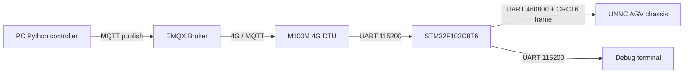

# 4G-MQTT Communication for Smart Traffic Cones

## English Version

This repository contains the remote communication subsystem of the 2026 FURP project **"Enhancing Road Safety through IoT-Enabled Smart Traffic Cones"**. It delivers PC control commands to a smart traffic cone's AGV chassis over MQTT and a 4G connection.

> Project status: research prototype. The command downlink is implemented; complete status uplink, link-loss protection, and production-grade security are not.

## System Path



The PC sends a five-field CSV line. The STM32 validates the values and converts them into a binary AGV control frame:

```text
left_pwm,right_pwm,pulses,angle_left,angle_right\n
```

See the [communication protocol](docs/protocol.md) for the exact format.

## Implementation Status

| Feature | Status | Notes |
| --- | --- | --- |
| PC publishes MQTT commands | Implemented | Python with `paho-mqtt` |
| EMQX forwarding | Verified | Tested baseline: EMQX 5.3.2 |
| M100M subscribes over 4G | Verified | Transparent UART output to STM32 USART3 |
| Text validation and AGV frame packing | Implemented | STM32F103C8T6 is the main delivery target |
| AGV control-frame transmission | Implemented | USART2 at 460800 baud |
| AGV status uplink | Not implemented | Protocol types exist, but the main path is not connected |
| Heartbeat, timeout stop, remote emergency stop | Not implemented | A physical emergency stop is mandatory |
| Per-device authentication, TLS, fine-grained ACL | Incomplete | Current setup is limited to a controlled research environment |

## Hardware Baseline

- M100M 4G DTU without GPS, running DTU/transparent-transmission firmware.
- STM32F103C8T6 controller.
- UNNC AGV chassis.
- ST-Link, USB-to-TTL adapters, power supplies, and UART wiring.

The F1 firmware is the main version. The STM32H750/H7 project is retained only as an early prototype.

## Repository Layout

| Path | Contents |
| --- | --- |
| [`before get started/`](before%20get%20started/README.md) | Project background, early research, BOMs, and the original architecture diagram |
| [`docs/`](docs/README.md) | Protocol, integration testing, acceptance, and troubleshooting |
| [`firmware/`](firmware/README.md) | Main STM32 F1 firmware and archived H7 prototype |
| [`hardware/`](hardware/README.md) | Hardware, AGV interfaces, expansion board, and 4G module material |
| [`images/`](images/README.md) | Images used by repository documentation |
| [`pc control/`](pc%20control/README.md) | PC MQTT controller |
| [`server/`](server/README.md) | EMQX deployment and security configuration |

## Before the First Run

1. **Make the mechanics safe:** lift the drive wheels or use an isolated test area, and verify the physical emergency stop.
2. **Do not reuse historical credentials:** the current working copy still contains an old public address and weak test password. Replace them and rotate the server credentials.
3. **Do not publish runtime data:** never commit EMQX `data/`, `log/`, private keys, tokens, IMEI values, or SIM information.
4. **Verify electrical parameters:** cross TX/RX, connect a common ground, and confirm power and TTL voltage levels before power-up.
5. **Start with F1:** do not begin a handover deployment from the H7 prototype.

## End-to-End Setup

### 1. Prepare the Hardware

Use the [hardware guide](hardware/README.md) to prepare the M100M, STM32F103C8T6, AGV, ST-Link, and USB-to-TTL adapters. Inspect all wiring while power is disconnected.

### 2. Deploy the MQTT Broker

Follow the [EMQX deployment guide](server/README.md). Confirm that:

- The MQTT TCP listener is reachable from both the PC and DTU.
- The PC and DTU use different Client IDs.
- The PC account can publish only to the command topic.
- The DTU account can subscribe only to its device command topic.
- The Dashboard is not exposed openly to the Internet.

### 3. Configure the M100M

Follow the [M100M configuration guide](hardware/4G%20module/M100M/README.md):

- UART: 115200 baud, 8 data bits, 1 stop bit, no parity, no flow control.
- Mode: MQTT transparent transmission.
- Broker, port, username, and password: match the server.
- Subscribe topic: exactly match the PC publish topic.
- Client ID: unique for each DTU.

Test the DTU UART through a USB-to-TTL adapter before connecting it to the STM32.

### 4. Build and Flash the F1 Firmware

Open:

```text
firmware/STM32 F1 Version/f1version program/F1/MDK-ARM/F1.uvprojx
```

Select the `F1` target, build it, and flash through ST-Link. The current target is STM32F103C8 with Keil STM32F1 Device Family Pack 2.2.0. A historical build log reports 0 errors and 0 warnings, but every handover must rebuild the project locally.

See the [F1 firmware guide](firmware/STM32%20F1%20Version/README.md).

### 5. Connect the Communication Links

| Connection | Signal |
| --- | --- |
| M100M TXD -> STM32 | PB11 / USART3 RX |
| M100M RXD <- STM32 | PB10 / USART3 TX |
| STM32 -> AGV | PA2 / USART2 TX -> AGV RX |
| STM32 <- AGV | PA3 / USART2 RX <- AGV TX |
| STM32 debug | PA9 / USART1 TX -> USB-to-TTL RX |
| Reference | Common GND between M100M, STM32, AGV, and USB-to-TTL |

Do not infer pins from wire colors. Treat the [AGV hardware guide](hardware/interface%20specification/AGV%20硬件说明.pdf) and [AGV secondary-development interface](hardware/interface%20specification/AGV%20二次开发接口.pdf) as authoritative.

### 6. Configure the PC Controller

Install the dependency in a virtual environment:

```powershell
cd "pc control\Python_Control\pc_send"
py -m venv .venv
.\.venv\Scripts\Activate.ps1
py -m pip install paho-mqtt
```

Edit the configuration section in `pc_auto_sender.py` so the Broker, credentials, Client ID, and topic match EMQX and the M100M. For the first test, use:

```python
LEFT_PWM = 0
RIGHT_PWM = 0
PULSES = 0
ANGLE_LEFT = 0.0
ANGLE_RIGHT = 0.0
REPEAT_COUNT = 1
```

Run:

```powershell
py pc_auto_sender.py
```

### 7. Verify the Complete Path

Use the [integration and acceptance guide](docs/testing.md) to check each stage:

1. The PC connects and publishes successfully.
2. The EMQX Dashboard shows both PC and DTU online.
3. The M100M UART emits the complete zero-value command.
4. STM32 USART1 echoes the command and prints `[PC CMD -> USART2]`.
5. STM32 USART2 emits a frame starting with `AA 55` and ending with `0D 0A`.
6. Only after the zero-value test is safe should a controlled low-speed test begin.

Do not skip staged testing and immediately run the AGV on the ground.

## Documentation

- [Project background and early research](before%20get%20started/README.md)
- [Communication protocol](docs/protocol.md)
- [Integration, acceptance, and troubleshooting](docs/testing.md)
- [M100M configuration](hardware/4G%20module/M100M/README.md)
- [EMQX deployment](server/README.md)
- [F1 firmware](firmware/STM32%20F1%20Version/README.md)
- [PC controller](pc%20control/README.md)

## Known Limitations

- Only the command downlink is implemented.
- There is no application-level sequence number, deduplication, acknowledgement, or timeout stop.
- The PC script still stores configuration in source code rather than environment variables.
- Historical deployment uses plaintext MQTT TCP and is unsuitable for production or an open network.
- The control structure contains C bit-fields and floating-point values; binary layout must be revalidated after any compiler or platform change.

## Pre-Publication Checklist

- Remove Keil installers, Device Packs, redistributable third-party software, and oversized files.
- Remove nested `.git` directories, build output, user settings, and logs from firmware projects.
- Remove the EMQX distribution, `data/`, `log/`, and real certificates.
- Remove real addresses and credentials from the PC script, then rotate every exposed password.
- Remove token logs from the AIR780 research package.
- Add and verify a repository-level `.gitignore`.
- Check redistribution rights for third-party documents, posters, software, and vendor packages.
- Reproduce the system from a clean environment and record the result in the [test log](docs/testing.md).

## Maintenance Rule

Whenever the protocol, pins, topic convention, or toolchain changes, update the code, the relevant module README, and the test record together. Never store real passwords, tokens, private keys, IMEI values, SIM information, or personal accounts in documentation.

---

# 中文版

本仓库是 2026 FURP 项目 **“Enhancing Road Safety through IoT-Enabled Smart Traffic Cones”** 的远程通信部分，负责把 PC 端控制命令经 MQTT 和 4G 网络传送到智能交通锥的 AGV 底盘。

> 项目状态：研究原型。当前已实现控制命令下行链路，尚未实现完整状态回传、失联保护和生产级安全机制。

## 系统链路


当前 PC 消息是一行五字段 CSV 文本。STM32 校验字段后，将其转换为 AGV 二进制控制帧：

```text
left_pwm,right_pwm,pulses,angle_left,angle_right\n
```

详细格式参见 [通信协议](docs/protocol.md)。

## 当前实现

| 功能 | 状态 | 说明 |
| --- | --- | --- |
| PC 发布 MQTT 控制命令 | 已实现 | Python + `paho-mqtt` |
| EMQX 转发 | 已验证 | 当前测试基线为 EMQX 5.3.2 |
| M100M 通过 4G 订阅命令 | 已验证 | DTU 透传到 STM32 USART3 |
| STM32 文本校验与 AGV 打包 | 已实现 | STM32F103C8T6 为主要交付版本 |
| AGV 控制帧发送 | 已实现 | USART2，460800 baud |
| AGV 状态上行 | 未实现 | 代码中有协议类型定义，但主链路未接入 |
| 心跳、超时停车、远程急停 | 未实现 | 实机测试必须保留物理急停 |
| 多设备鉴权、TLS、细粒度 ACL | 未完成 | 当前配置仅适合受控研究环境 |

## 硬件基线

- M100M 4G DTU，无 GPS，使用 DTU/透传固件。
- STM32F103C8T6 控制板。
- UNNC AGV 底盘。
- ST-Link、USB-TTL、供电线和串口连接线。

F1 是当前主要版本；STM32H750/H7 工程仅用于保留早期原型。

## 仓库结构

| 路径 | 内容 |
| --- | --- |
| [`before get started/`](before%20get%20started/README.md) | 项目背景、早期调研、物料表和原始结构图 |
| [`docs/`](docs/README.md) | 通信协议、联调、验收和故障排查 |
| [`firmware/`](firmware/README.md) | STM32 F1 主要固件与 H7 原型 |
| [`hardware/`](hardware/README.md) | 硬件、AGV 接口、扩展板和 4G 模块资料 |
| [`images/`](images/README.md) | README 和文档使用的图片 |
| [`pc control/`](pc%20control/README.md) | PC MQTT 控制程序 |
| [`server/`](server/README.md) | EMQX 部署与安全配置说明 |

## 首次运行前

1. **保证机械安全**：抬起驱动轮或让 AGV 位于隔离测试区，确认物理急停可用。
2. **不要直接使用旧凭据**：当前工作副本中的 PC 脚本仍含历史测试地址和弱密码，提交或运行前必须替换，并轮换服务器凭据。
3. **不要公开运行数据**：EMQX 的 `data/`、`log/`、私钥、Token、IMEI 和 SIM 信息不得提交。
4. **确认电气参数**：所有 UART 共地、TX/RX 交叉；上电前核对供电电压和 TTL 电平。
5. **使用 F1 版本**：首次接手不要从 H7 原型开始。

## 从零跑通

### 1. 准备硬件

根据 [硬件说明](hardware/README.md) 准备 M100M、STM32F103C8T6、AGV、ST-Link 和 USB-TTL。先完成断电接线检查，不连接电机负载进行盲测。

### 2. 部署 MQTT Broker

按照 [EMQX 部署说明](server/README.md) 安装并启动 EMQX。确认：

- MQTT TCP 端口可被 PC 和 DTU 访问。
- PC 与 DTU 使用不同的 Client ID。
- PC 账号只能发布命令 Topic。
- DTU 账号只能订阅对应设备的命令 Topic。
- Dashboard 不直接暴露到公网。

### 3. 配置 M100M

按照 [M100M 配置说明](hardware/4G%20module/M100M/README.md) 设置：

- UART：115200、8 数据位、1 停止位、无校验、无流控。
- 工作模式：MQTT 透传。
- Broker、端口、用户名和密码：与服务器一致。
- 订阅 Topic：与 PC 程序发布 Topic 完全一致。
- Client ID：每台 DTU 唯一。

配置完成后先通过 USB-TTL 验证 DTU UART 输出，再连接 STM32。

### 4. 编译和烧录 F1 固件

打开：

```text
firmware/STM32 F1 Version/f1version program/F1/MDK-ARM/F1.uvprojx
```

选择 `F1` Target，编译并通过 ST-Link 烧录。当前工程目标为 STM32F103C8，使用 Keil STM32F1 Device Family Pack 2.2.0；仓库内已有一次 0 error、0 warning 的历史构建记录，但接手后仍应重新编译。

完整步骤参见 [F1 固件说明](firmware/STM32%20F1%20Version/README.md)。

### 5. 完成通信接线

| 连接 | 信号 |
| --- | --- |
| M100M TXD -> STM32 | PB11 / USART3 RX |
| M100M RXD <- STM32 | PB10 / USART3 TX |
| STM32 -> AGV | PA2 / USART2 TX -> AGV RX |
| STM32 <- AGV | PA3 / USART2 RX <- AGV TX |
| STM32 调试 | PA9 / USART1 TX -> USB-TTL RX |
| 公共参考 | M100M、STM32、AGV、USB-TTL GND 共地 |

不要根据线材颜色猜测引脚。AGV 接口以 [AGV 硬件说明](hardware/interface%20specification/AGV%20硬件说明.pdf) 和 [AGV 二次开发接口](hardware/interface%20specification/AGV%20二次开发接口.pdf) 为准。

### 6. 配置 PC 程序

进入 PC 脚本目录并安装依赖：

```powershell
cd "pc control\Python_Control\pc_send"
py -m venv .venv
.\.venv\Scripts\Activate.ps1
py -m pip install paho-mqtt
```

运行前修改 `pc_auto_sender.py` 的配置区，使 Broker、账号、Client ID 和 Topic 与 EMQX/M100M 一致。首次测试必须把运动参数设为：

```python
LEFT_PWM = 0
RIGHT_PWM = 0
PULSES = 0
ANGLE_LEFT = 0.0
ANGLE_RIGHT = 0.0
REPEAT_COUNT = 1
```

然后执行：

```powershell
py pc_auto_sender.py
```

### 7. 验证端到端链路

按 [联调与验收](docs/testing.md) 分段检查：

1. PC 是否成功连接并发布。
2. EMQX Dashboard 是否看到 PC 和 DTU 在线。
3. M100M UART 是否输出完整的零值命令。
4. STM32 USART1 是否回显命令并输出 `[PC CMD -> USART2]`。
5. STM32 USART2 是否输出以 `AA 55` 开头、`0D 0A` 结尾的帧。
6. 确认零值命令不会造成运动后，再进行受控低速测试。

不要跳过分段测试直接让 AGV 落地运行。

## 文档入口

- [项目背景与早期调研](before%20get%20started/README.md)
- [通信协议](docs/protocol.md)
- [联调、验收与故障排查](docs/testing.md)
- [M100M 配置](hardware/4G%20module/M100M/README.md)
- [EMQX 部署](server/README.md)
- [F1 固件](firmware/STM32%20F1%20Version/README.md)
- [PC 控制程序](pc%20control/README.md)

## 已知限制

- 当前只有控制下行，没有完整 AGV 状态回传链路。
- 没有应用层命令序号、去重、确认应答和超时停车机制。
- PC 脚本仍采用源码内配置，尚未改为环境变量。
- 当前历史配置使用明文 MQTT TCP，不应直接用于生产或开放网络。
- 控制结构包含 C 位域和浮点数，更换编译器或平台时必须重新验证二进制布局。

## 发布前检查

- 删除 Keil 安装程序、Device Pack、第三方可下载软件和超大文件。
- 删除固件工程中的嵌套 `.git`、编译产物、用户配置和日志。
- 删除 EMQX 发行包、`data/`、`log/` 和真实证书。
- 清除 PC 脚本中的真实地址、账号和密码并轮换旧凭据。
- 删除 AIR780 资料中的 Token 日志。
- 添加并验证根目录 `.gitignore`。
- 检查第三方文档、海报、软件和资料包的再分发许可。
- 完成一次从干净环境开始的端到端复现，并在 [测试记录](docs/testing.md) 中记录结果。

## 维护原则

协议、引脚、Topic 或工具链发生变化时，应同时更新代码、对应模块 README 和测试记录。文档中不得保存真实密码、Token、私钥、IMEI、SIM 卡信息或个人账号。
