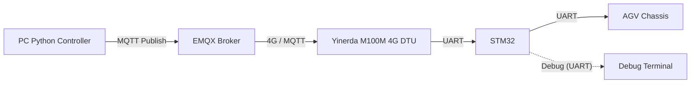

# 4G-MQTT Communication for Smart Traffic Cones

## Introduction

This repository contains the remote communication solution developed for the 2026 UNNC FURP project **"Enhancing Road Safety through IoT-Enabled Smart Traffic Cones"**. The main task of this part of the project is to deliver a control command generated on a PC to the AGV chassis inside a smart traffic cone through an MQTT server and a 4G network, so that the cone can be controlled remotely.

本仓库是宁波诺丁汉大学 2026 暑期 FURP 项目 **"Enhancing Road Safety through IoT-Enabled Smart Traffic Cones"** 的远程通信实现方案。作者主要负责把 PC 端生成的控制命令，经 MQTT 服务器和 4G 网络传送到智能交通锥的 AGV 底盘，从而实现对交通锥的远程控制。

The repository collects the early project background and research, firmware, hardware materials, server files, and PC control code. It is intended to give the next developer a clear starting point rather than to present a finished commercial product. Please read the notes in each folder before modifying the corresponding part of the system.

本仓库包含项目早期背景与调研、固件、硬件资料、服务器文件和 PC 控制代码。它的目的不是展示一个已经商业化的成品，而是让下一位接手者能够较快了解整个通信部分，并在此基础上继续开发。修改某一部分之前，建议先阅读对应文件夹内的资料。

## System Overview

The PC control program and the smart traffic cone communication module are both connected to an MQTT Broker. A command published by the PC is received by the Yinerda M100M 4G DTU, transparently forwarded to an STM32, converted into an AGV control frame, and finally sent to the AGV chassis.

在该通信系统中，PC 控制程序和智能交通锥的通信模块都连接到 MQTT 服务器。PC 发布的控制命令会由银达尔 Yinerda M100M 4G DTU 接收并透传给 STM32，STM32 再将文本命令转换为 AGV 所需的控制帧，最后发送到 AGV 底盘。



The 4G + MQTT communication path has been tested as a research prototype. However, the project should still be treated as an engineering prototype: every new hardware setup, server configuration, and firmware change needs to be tested again before controlling a real vehicle.

目前 MQTT + 4G 通信链路已经作为研究原型完成验证，但整个项目仍应被视为工程原型。每次更换硬件、服务器配置或固件版本后，都应重新测试，再用于实际车辆控制。

## Main Implementation

The current communication path uses the following components:

当前通信链路主要由以下部分组成：

| Part | Implementation |
| --- | --- |
| PC control | A Python script publishes control messages to MQTT. |
| MQTT server | EMQX is deployed on an Alibaba Cloud ECS instance and used as the MQTT Broker. |
| 4G communication | A Yinerda M100M 4G DTU receives MQTT messages and transparently outputs them through UART. |
| MCU | STM32F103C8T6 receives the command, validates it, and forwards it to the AGV. |
| AGV interface | The AGV UART protocol and frame definition are provided in the hardware interface material. |

| 部分 | 实现方式 |
| --- | --- |
| PC 控制端 | 使用 Python 脚本向 MQTT 发布控制消息。 |
| MQTT 服务器 | 在阿里云 ECS 云服务器上部署 EMQX，作为 MQTT Broker。 |
| 4G 通信 | 使用银达尔 Yinerda M100M 4G DTU 接收 MQTT 消息，并通过 UART 透传输出。 |
| MCU | STM32F103C8T6 接收命令、校验命令并转发给 AGV。 |
| AGV 接口 | AGV 的串口协议和帧定义由硬件接口资料提供。 |

The STM32 is used as a communication and protocol-conversion station. In a future version, it could be replaced by a simpler and lower-cost controller, provided that the replacement has enough UART interfaces and can correctly implement the AGV protocol.

STM32 在本项目中主要起到通信中转和协议转换的作用。未来如果功能需求没有明显增加，也可以使用更简单、成本更低的芯片替代，但前提是该芯片具有足够的 UART 接口，并能够正确实现 AGV 协议。

## Background and Research

The project began from a final-year undergraduate student's graduation project. The poster and background material in `before get started/step1 background for the project/` provide a quick introduction to the original idea and project context.

该项目最初源于一位大四学生的毕业设计。`before get started/step1 background for the project/` 中的海报和背景资料可以帮助读者快速了解项目最初的想法和背景。

As the author was responsible for the communication part, the available approaches were researched in detail before selecting a 4G module + MQTT solution. The investigation and proposed design are retained in `before get started/step2 research/` for reference.

由于作者主要负责通信部分，因此在确定方案前对不同实现方式进行了较为详细的调研，最终选择了 4G 模块 + MQTT 的通信方案。相关调查和方案设计保留在 `before get started/step2 research/` 中，供后续开发参考。

## Firmware

The author focused on implementing the communication function rather than building a complete general-purpose firmware framework. The source code is therefore provided as a functional reference and still needs further integration and optimisation before it can be used in an industrial setting.

作者主要负责通信功能的实现，而不是构建一套完整的通用固件框架。因此，本工程代码主要作为功能实现参考；若要应用于实际工业场景，仍需要后续的整合与优化。

For further STM32 development, STM32CubeMX + Keil is recommended for peripheral configuration, project management, building, and flashing. Keil can also be integrated with VS Code as an editing environment, while Codex can assist with code reading, modification, and routine development work. Any change to the hardware configuration must still be verified on the physical system.

后续进行 STM32 开发时，建议使用 STM32CubeMX + Keil 完成外设配置、工程管理、编译和烧录；也可以将 Keil 与 VS Code 配合，作为更方便的代码编辑环境，并充分利用 Codex 辅助阅读、修改和编写代码。但凡涉及硬件配置的修改，仍需要在实际系统上完成验证。

Two implementation versions are included in `firmware/`. The H750/H7 version is an early prototype: it is more complicated and more expensive, so it is not recommended for continued development. The F1 version is lower-cost and contains the main validated communication path, so it is the recommended starting point.

`firmware/` 中保留了两套实现方案。H750/H7 版本属于早期原型，工程更复杂、成本也更高，不推荐作为后续开发的基础；F1 版本成本较低，并包含当前主要验证过的通信链路，因此推荐从 F1 版本继续开发。

In this project, the STM32 works mainly as a data relay. The control path uses one USART to receive text commands transparently forwarded by the Yinerda M100M 4G DTU and another USART to send binary control frames to the AGV. A third USART is reserved for serial debug output during testing.

在本项目中，STM32 主要承担数据中转的作用。控制链路使用一个 USART 接收银达尔 Yinerda M100M 4G DTU 透传下来的文本命令，再使用另一个 USART 向 AGV 发送二进制控制帧；此外，还配置了第三个 USART 用于实验过程中的串口调试输出。

For the F1 version, USART1 outputs debug logs, USART2 sends binary AGV control frames, and USART3 receives the MQTT command text forwarded by the DTU. Developers who are already familiar with STM32 can configure these interfaces according to the project requirements; beginners should first study basic STM32 UART configuration material before making changes.

对于 F1 版本，USART1 用于输出调试日志，USART2 用于向 AGV 发送二进制控制帧，USART3 用于接收 DTU 透传下来的 MQTT 命令文本。熟悉 STM32 的开发者可以根据项目需要自行配置这些串口；如果对 STM32 不熟悉，建议先学习基础的 UART 配置资料后再进行修改。

The F1 Keil project is located at:

F1 版本的 Keil 工程位于：

```text
firmware/STM32 F1 Version/f1version program/F1/MDK-ARM/F1.uvprojx
```

## Control Message Format

The PC script publishes one newline-terminated CSV command. The STM32 accepts the command only when it contains exactly five valid fields in the following order:

PC 脚本发布的是一行以换行符结束的 CSV 命令。STM32 只会在命令恰好包含以下五个合法字段且顺序正确时接受该命令：

```text
left_pwm,right_pwm,pulses,angle_left,angle_right\n
```

Example:

示例：

```text
-40,-40,500,0.00,0.00\n
```

| Field | Type and valid range | Meaning |
| --- | --- | --- |
| `left_pwm` | Integer, -100 to 100 | Left motor PWM command. |
| `right_pwm` | Integer, -100 to 100 | Right motor PWM command. |
| `pulses` | Integer, 0 to 100000 | Motion pulse/count parameter required by the AGV protocol. |
| `angle_left` | Decimal, -90.0 to 90.0 | Left angle-control value. |
| `angle_right` | Decimal, -90.0 to 90.0 | Right angle-control value. |

| 字段 | 类型和合法范围 | 含义 |
| --- | --- | --- |
| `left_pwm` | 整数，-100 到 100 | 左电机 PWM 控制值。 |
| `right_pwm` | 整数，-100 到 100 | 右电机 PWM 控制值。 |
| `pulses` | 整数，0 到 100000 | AGV 协议使用的运动脉冲或计数参数。 |
| `angle_left` | 小数，-90.0 到 90.0 | 左侧角度控制值。 |
| `angle_right` | 小数，-90.0 到 90.0 | 右侧角度控制值。 |

The newline is important because the F1 firmware uses it to determine the end of a command. Do not add field names, units, additional fields, or scientific notation such as `1e2`. For a first test, use the zero-value command `0,0,0,0.00,0.00\n`.

换行符非常重要，因为 F1 固件依靠它判断一条命令是否结束。不要加入字段名称、单位、额外字段，或 `1e2` 一类科学计数法。第一次测试时应使用零值命令 `0,0,0,0.00,0.00\n`。

The detailed command and AGV frame definition is available in [docs/protocol.md](docs/protocol.md).

更详细的命令格式和 AGV 帧定义见 [docs/protocol.md](docs/protocol.md)。

## Repository Structure

The folders below contain the main project materials. The root README is deliberately the only README file in the repository so that project information remains in one place.

以下文件夹包含项目的主要资料。为避免说明分散，本仓库只保留这一份根目录 README，所有整体信息集中在此处。

| Folder | Contents |
| --- | --- |
| `before get started/` | Project background, posters, early research, and design investigation. |
| `firmware/` | STM32 F1 main firmware and the early H7 prototype. |
| `hardware/` | 4G module materials, AGV interface specifications, and expansion-board PCB files. |
| `pc control/` | Python MQTT control script and related PC-side material. |
| `server/` | EMQX server files and historical deployment material. |
| `docs/` | Communication protocol and integration-testing notes. |
| `images/` | A place for system diagrams, wiring photographs, test screenshots, and other documentation images. |

| 文件夹 | 内容 |
| --- | --- |
| `before get started/` | 项目背景、海报、早期调研和方案设计资料。 |
| `firmware/` | STM32 F1 主固件和早期 H7 原型。 |
| `hardware/` | 4G 模块资料、AGV 接口规范和扩展底座 PCB 文件。 |
| `pc control/` | Python MQTT 控制脚本及 PC 端相关资料。 |
| `server/` | EMQX 服务器文件和历史部署资料。 |
| `docs/` | 通信协议和联调测试说明。 |
| `images/` | 用于存放系统结构图、接线照片、测试截图及其他说明图片。 |

## Suggested Starting Procedure

1. Read the project background and research in `before get started/` to understand why MQTT and a 4G DTU were selected.
2. Start from the STM32 F1 version, not from the H7 prototype.
3. Read `docs/protocol.md` and the AGV interface material before modifying the command format or frame structure.
4. Configure the MQTT Broker, PC script, and Yinerda M100M DTU with matching topics, different Client IDs, and new credentials.
5. Test the DTU UART link first, then the STM32 debug output, then the USART2 AGV frame, and only then connect the AGV for a controlled test.

1. 先阅读 `before get started/` 中的背景和调研资料，了解为什么最终选择 MQTT 和 4G DTU 的方案。
2. 后续开发应从 STM32 F1 版本开始，而不是从 H7 原型开始。
3. 修改命令格式或帧结构前，应先阅读 `docs/protocol.md` 和 AGV 接口资料。
4. 配置 MQTT Broker、PC 脚本和银达尔 Yinerda M100M DTU 时，应保证 Topic 一致、Client ID 不重复，并使用新的账号密码。
5. 应先测试 DTU 串口链路，再测试 STM32 调试输出，然后观察 USART2 AGV 帧，最后才连接 AGV 做受控测试。

The PC control script is located at:

PC 控制脚本位于：

```text
pc control/Python_Control/pc_send/pc_auto_sender.py
```

Install its dependency and run it from the script directory:

在脚本所在目录安装依赖并运行：

```powershell
py -m pip install -U paho-mqtt
py pc_auto_sender.py
```

Before running, replace any historical Broker address, username, password, Client ID, and Topic in the configuration section with values for the current deployment. Do not upload real credentials, tokens, IMEI values, SIM information, certificates, or server logs to a public repository.

运行前，应把脚本配置区中的历史 Broker 地址、账号、密码、Client ID 和 Topic 替换为当前部署所使用的值。不要把真实账号密码、Token、IMEI、SIM 信息、证书或服务器日志上传到公开仓库。

## Testing and Safety

This project can control an AGV, so communication testing must be performed carefully. Lift the drive wheels off the ground or use a clear and isolated test area. Verify that a physical emergency stop is available before sending any non-zero command.

本项目涉及 AGV 控制，因此通信测试必须谨慎进行。测试时应抬起驱动轮，或在清空、隔离的测试区域进行；发送任何非零命令前，必须确认物理急停装置可用。

MQTT QoS 1 only confirms that the MQTT Broker accepted the published message. It does not prove that the DTU, STM32, or AGV received and executed the command. The current project also does not contain a complete AGV status uplink or application-level acknowledgement path.

MQTT QoS 1 只表示 MQTT Broker 已确认接收发布消息，并不代表 DTU、STM32 或 AGV 已经收到并执行该命令。当前项目也尚未实现完整的 AGV 状态上行或应用层确认链路。

For a staged test procedure and troubleshooting notes, see [docs/testing.md](docs/testing.md).

分阶段测试流程和故障排查说明见 [docs/testing.md](docs/testing.md)。

## Limitations and Future Work

- The communication module currently relies on a power bank. A compact and safe independent power system would make the design more practical.
- The STM32 is more capable than necessary for the current forwarding task. A future low-cost controller and a dedicated PCB could simplify the design.
- The historical server setup was built for research use. A deployable product would need a maintained server, stronger access control, TLS, credential rotation, and monitoring.
- 4G communication is expected to work well where mobile coverage is available, but performance in remote or weak-signal areas still requires field testing.
- The system currently focuses on command downlink. Status uplink, heartbeat, timeout stop, command acknowledgement, and loss-of-link protection remain future work.

- 当前通信模块依赖充电宝供电。后续如果能设计一套紧凑、安全的独立供电系统，整体方案会更实用。
- 对于当前的数据中转任务而言，STM32 的能力偏富余。未来可以选用更低成本的控制器并设计专用 PCB，使方案更加简单。
- 历史服务器配置主要面向科研使用。若要做成可部署的产品，需要维护服务器、加强访问控制、使用 TLS、定期轮换凭据并加入监控。
- 理论上只要有稳定的 4G 信号，通信就应较为稳定；但在偏远地区或弱信号场景下，仍需要进一步进行现场测试。
- 当前系统主要完成控制命令下行。状态上行、心跳、超时停车、命令确认和失联保护仍是后续工作。

## Contact

Questions during handover, development, or optimization are welcome. Please contact James Zhao at `jameszhao2277@gmail.com`, `ssyzz41@nottingham.edu.cn`, or `ssyzz41@nottingham.ac.uk`.

如果在接手、开发或优化过程中有任何疑问，也欢迎联系本仓库作者 James Zhao：`jameszhao2277@gmail.com`、`ssyzz41@nottingham.edu.cn` 或 `ssyzz41@nottingham.ac.uk`。
